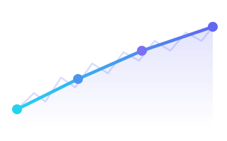

# InfluxDB Downsampling Manager


[](https://github.com/Xyaren/influx-downsample-manager/actions/workflows/ci.yml)
[](https://github.com/Xyaren/influx-downsample-manager/actions/workflows/release.yml)
[](https://www.gnu.org/licenses/gpl-3.0)
[](https://github.com/Xyaren/influx-downsample-manager/pkgs/container/influx-downsample-manager)

Automated tool that creates and manages downsampling tasks for InfluxDB. It discovers measurements and fields in your source buckets, creates downsampled copies at configurable intervals and retention periods, and generates Flux query tasks with intelligent offset scheduling to avoid thundering-herd problems.

## Features

- Automatic measurement and field-type detection from source buckets
- Multi-tier downsampling with configurable intervals, retention, and shard group durations
- Chained aggregation — coarser tiers can read from finer tiers instead of raw data
- Deterministic task offset spreading via SHA-256 hashing
- Idempotent operation — safe to run repeatedly (creates or updates resources as needed)
- Label-based resource tracking for easy identification and cleanup
- Automatic cleanup of orphaned tasks and labels

## Requirements

- Python 3.14+
- InfluxDB 2.x instance with a valid API token

## Installation

### Local

```bash
# Clone the repository
git clone <repo-url>
cd influx-downsample-manager

# Create and activate a virtual environment
python -m venv venv

# Windows
venv\Scripts\activate
# Linux / macOS
source venv/bin/activate

# Install dependencies
pip install -r requirements.txt
```

### Docker

```bash
# Pull the pre-built image from GitHub Container Registry
docker pull ghcr.io/xyaren/influx-downsample-manager:latest

# Or build locally
docker build -t influx-downsample-manager .
```

## Configuration

Copy the example config and edit it:

```bash
cp config.example.yaml config.yaml
```

### Config file structure

```yaml
# InfluxDB connection
influxdb:
  org: "my-org"
  url: "https://influxdb.example.com"
  token: ""  # or set INFLUXDB_TOKEN env var

# Buckets to downsample
source_buckets:
  - "telegraf/autogen"
  - "my-app"

# How far back to look when detecting measurements/fields
metric_detection_duration: "1d"

# Downsampling tiers keyed by target bucket suffix
downsample_configs:
  "1w":
    interval: "1m"        # Aggregation window
    every: "15m"          # Task run frequency
    offset: "30s"         # Minimum task offset
    max_offset: "13m"     # Maximum task offset (spread via hash)
    expires: "1w"         # Target bucket retention
    bucket_shard_group_interval: "1d"
  "31d":
    interval: "10m"
    every: "1h"
    offset: "1m"
    max_offset: "55m"
    expires: "31d"
    bucket_shard_group_interval: "3d"
    chained: true         # Read from the finer tier above
  "inf":
    interval: "1h"
    every: "1d"
    offset: "5m"
    max_offset: "1h"
    bucket_shard_group_interval: "30d"
    chained: true
```

### Downsample config fields

| Field | Required | Description |
|---|---|---|
| `interval` | Yes | Aggregation window size (e.g. `"1m"`, `"10m"`, `"1h"`). |
| `every` | Yes | How often the InfluxDB task runs. |
| `offset` | Yes | Minimum task offset to stagger execution. |
| `max_offset` | No | Maximum task offset. Each task gets a deterministic offset between `offset` and `max_offset` based on a SHA-256 hash of the task name. |
| `expires` | No | Retention period for the target bucket. Omit for infinite retention. |
| `bucket_shard_group_interval` | No | Shard group duration for the target bucket. Tune for query performance. |
| `chained` | No | When `true`, this tier reads from the previous (finer) tier's bucket instead of the raw source. Reduces query load for coarser aggregations. Default: `false`. |

### Chained aggregation

Tiers are automatically sorted by interval (finest first). When `chained: true`, a tier reads pre-aggregated data from the tier directly above it rather than scanning raw points. This is a mean-of-means approach for numeric fields, which works well for monitoring data with fairly uniform sample rates. Non-numeric fields always use `last` and are unaffected.

Switching between `chained: true` and `chained: false` is safe at any time — no data migration is required.

**Trade-offs:**
- Reduces data scanned at coarser tiers
- Introduces a dependency: if a finer tier falls behind, coarser tiers will have stale data

### Environment variables

| Variable | Description |
|---|---|
| `INFLUXDB_TOKEN` | InfluxDB API token. Overrides the `token` field in `config.yaml`. |
| `INFLUXDB_ORG` | InfluxDB organization name. Overrides the `org` field in `config.yaml`. |
| `INFLUXDB_URL` | InfluxDB server URL. Overrides the `url` field in `config.yaml`. |
| `CONFIG_PATH` | Path to the config file. Defaults to `config.yaml` in the working directory. |

## Usage

### Local

```bash
python -m manager
```

### Docker

```bash
docker run --rm \
  -e INFLUXDB_URL="https://influxdb.example.com" \
  -e INFLUXDB_ORG="my-org" \
  -e INFLUXDB_TOKEN="your-token" \
  -v $(pwd)/config.yaml:/app/config.yaml \
  ghcr.io/xyaren/influx-downsample-manager:latest
```

### Docker Compose

```yaml
services:
  manager:
    image: ghcr.io/xyaren/influx-downsample-manager:latest
    volumes:
      - ./config.yaml:/app/config.yaml:ro
    environment:
      - INFLUXDB_URL=${INFLUXDB_URL}
      - INFLUXDB_ORG=${INFLUXDB_ORG}
      - INFLUXDB_TOKEN=${INFLUXDB_TOKEN}
      - CRON_SCHEDULE=0 */6 * * *
```

```bash
docker compose up
```

All three environment variables override their corresponding values in `config.yaml`, so you can keep secrets out of the config file.

#### Docker environment variables

| Variable | Description |
|---|---|
| `CRON_SCHEDULE` | Cron expression for periodic runs. Defaults to `0 */6 * * *` (every 6 hours). Set to empty or `false` to run once and exit. |

The container runs the manager once at startup and then on the `CRON_SCHEDULE` via cron.

## How it works

1. Connects to InfluxDB using the configured org, token, and URL
2. For each source bucket, queries measurements and detects field types (numeric vs. non-numeric)
3. Sorts downsampling configs by interval (finest first)
4. Creates target buckets with the specified retention policies (e.g. `telegraf/autogen_1w`, `telegraf/autogen_31d`)
5. For each tier and measurement, generates a Flux task that:
   - Aggregates numeric fields with `mean`
   - Aggregates non-numeric fields with `last`
   - Uses a deterministic offset to spread task execution times
6. Creates or updates tasks idempotently — unchanged tasks are skipped
7. Labels all managed resources for tracking
8. Cleans up orphaned tasks and labels from previous runs

## Project structure

```
├── manager/
│   ├── __init__.py                # Public API exports
│   ├── __main__.py                # CLI entry point (python -m manager)
│   ├── config.py                  # Configuration loading and parsing
│   ├── downsample_manager.py      # Core orchestration and InfluxDB API interactions
│   ├── query_generator.py         # Flux query generation (Source and Chained variants)
│   ├── model.py                   # Data structures (FieldData, DownsampleConfiguration, etc.)
│   └── utils.py                   # Helpers (hashing, duration conversion)
├── config.example.yaml            # Example configuration
├── config.yaml                    # Your local configuration (git-ignored)
├── requirements.txt               # Python dependencies
└── Dockerfile                     # Container build
```

## Contributing

See [CONTRIBUTING.md](CONTRIBUTING.md) for guidelines. Commits that include AI-assisted code must include a `Co-authored-by` trailer identifying the AI tool used.

## AI Disclaimer

Portions of this codebase were developed with the assistance of AI tools. All AI-generated code has been reviewed and approved by the project maintainer.

## License

This project is licensed under the [GNU General Public License v3.0](LICENSE).
Copyright © 2026 Tobias Günther (Xyaren)
